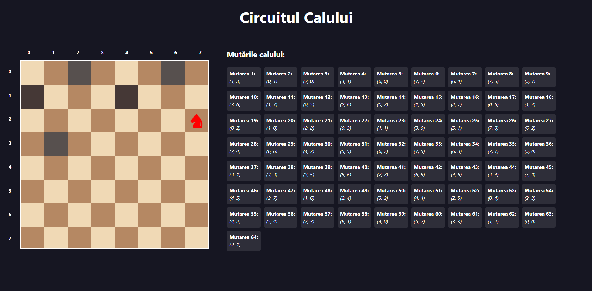

# Circuitul calului 

## Această problemă determină mutările calului astfel încât toate pozițiile tablei să fie acoperite

## Repository-ul conține urmatoarele fisiere: 

* Fișierele care au fost necesare pentru crearea si rularea site-ului folosind React

* Fișierul "Dockerfile" pentru a putea instala dependințele aplicației, pentru a construi și rula aplicația finala

* Fișierul .yml pentru a automatiza programul prin construirea și publicarea imaginii in package pe github 

## Instalare și Rulare

1. Instalarea package-ului **circuitul-calului** prin comanda: docker pull ghcr.io/davidsimoc/circuitul-calului/circuitul-calului:latest

2. Rularea imaginii cu comanda: docker run -d -p 8000:8000 ghcr.io/davidsimoc/circuitul-calului/circuitul-calului:latest

3. Pentru a vizualiza se va accesa link-ul: http://localhost:8000

## Vizualizare

O reprezentare vizuala care arata in timp real cum se mișcă pe tabla de șah calul, începând de la o pozitie aleatoare, iar în partea dreaptă se afla lista finala de mutari ale calului pentru a acoperi întreaga tablă.

